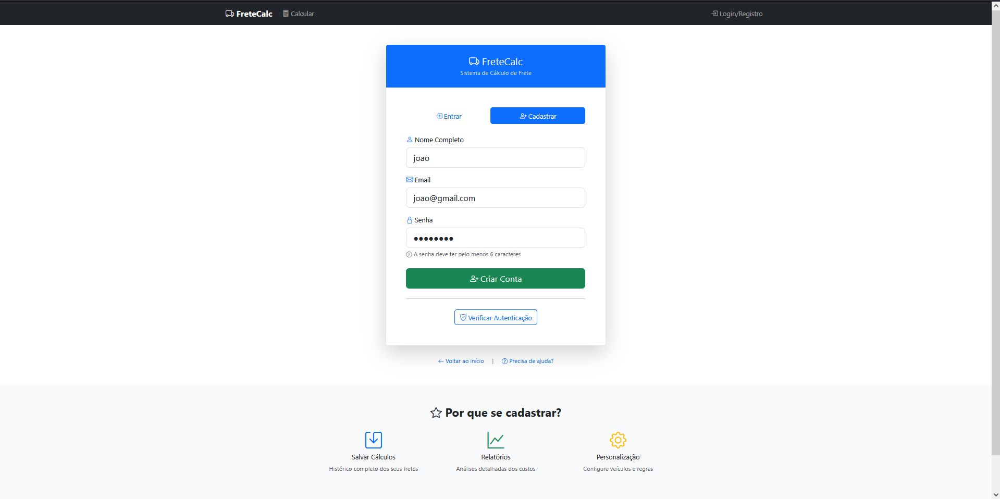
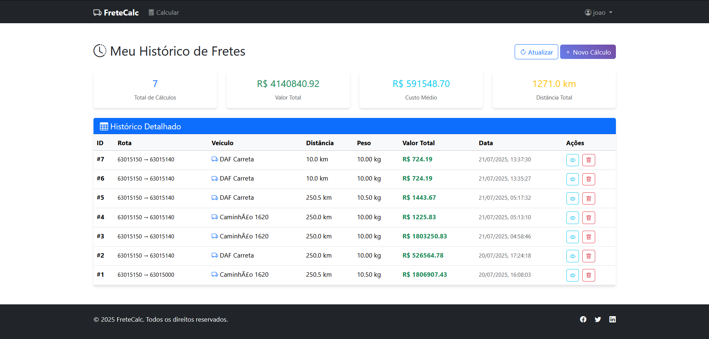
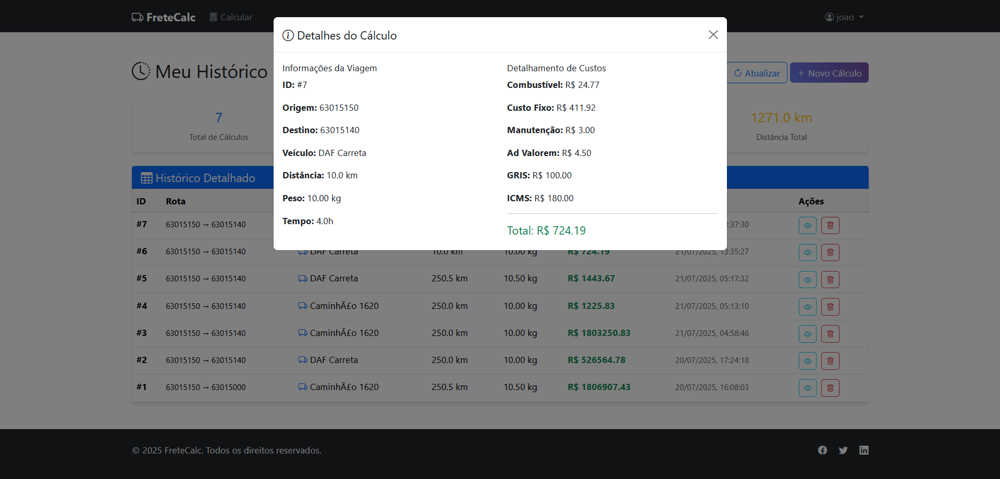
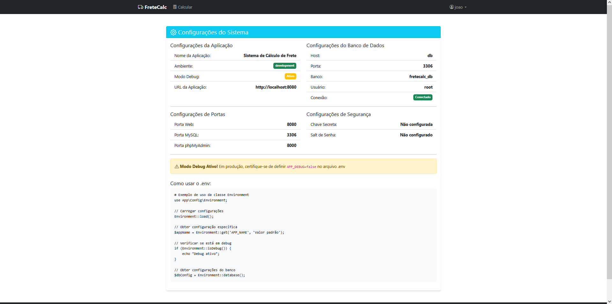

# 🚛 Sistema de Cálculo de Frete

Sistema web completo para cálculo de frete de cargas desenvolvido em PHP com Bootstrap, Docker e sistema de autenticação JWT.


## 📋 Funcionalidades

### 🔐 Sistema de Autenticação

- ✅ **Sistema de login e registro** com JWT (JSON Web Tokens)
- ✅ **Autenticação segura** com hash de senhas (bcrypt)
- ✅ **Controle de sessões** via localStorage
- ✅ **Sistema de logout** com limpeza de tokens
- ✅ **Proteção de rotas** para usuários autenticados
- 

### 👥 Gestão de Usuários

- ✅ **Registro de novos usuários** com validação
- ✅ **Login seguro** com verificação de credenciais
- ✅ **Perfis de usuário** (admin/user)
- ✅ **Histórico personalizado** por usuário
- ✅ **Dados de usuário** com nome, email e role

### 🚛 Cálculo de Frete

- ✅ **Cálculo automático** baseado em peso, distância e valor da carga
- ✅ **Múltiplos tipos de veículos** com características específicas
- ✅ **Cálculo de taxas** (Ad Valorem, GRIS, ICMS)
- ✅ **Custos operacionais** (combustível, manutenção, custos fixos)
- ✅ **Interface intuitiva** com formulário responsivo


### 📊 Painel Administrativo

- ✅ **Dashboard completo** com estatísticas do sistema
- ✅ **Gestão de veículos** (criar, editar, excluir)
- ✅ **Gestão de regras de custo** (preços, taxas, percentuais)
- ✅ **Gestão de usuários** (visualizar, alterar roles, excluir)
- ✅ **Histórico de viagens** (visualizar, filtrar, excluir)
- ✅ **Controle de acesso** restrito a administradores
- 

### 📈 Histórico e Relatórios

- ✅ **Histórico de cálculos** salvo automaticamente
- ✅ **Filtros por usuário** e período
- ✅ **Estatísticas detalhadas** (total de viagens, receita, distâncias)
- ✅ **Exportação de dados** em formato JSON
- 

### 🎨 Interface e UX

- ✅ **Interface moderna** com Bootstrap 5.3
- ✅ **Design responsivo** para dispositivos móveis
- ✅ **Menu dinâmico** que se adapta ao status de login
- ✅ **Notificações visuais** de sucesso/erro
- ✅ **Loading states** durante operações
- ✅ **Navegação intuitiva** com breadcrumbs
- 

### 🛡️ Segurança

- ✅ **JWT tokens** para autenticação segura
- ✅ **Hash de senhas** com bcrypt
- ✅ **Validação de entrada** em todos os formulários
- ✅ **Proteção CSRF** implícita
- ✅ **Sanitização de dados** de saída
- ✅ **Controle de acesso** baseado em roles

### 🔧 Tecnologias e Arquitetura

- ✅ **Autoload PSR-4** com Composer
- ✅ **Arquitetura MVC** bem estruturada
- ✅ **API RESTful** para operações CRUD
- ✅ **Banco de dados MySQL** com migrations
- ✅ **Ambiente Docker** completo
- ✅ **Gerenciamento de dependências** com Composer

## 🛠️ Tecnologias Utilizadas

- **Backend**: PHP 8.2, MySQL 8.0
- **Frontend**: Bootstrap 5.3, HTML5, CSS3, JavaScript
- **Containerização**: Docker, Docker Compose
- **Autoload**: Composer PSR-4
- **Banco de dados**: MySQL com phpMyAdmin
- **Arquitetura**: MVC (Model-View-Controller)

## 📁 Estrutura do Projeto

```
frete-calc/
├── .env                    # Configurações do ambiente
├── .env.example           # Template de configuração
├── .gitignore             # Arquivos ignorados pelo Git
├── .dockerignore          # Arquivos ignorados pelo Docker
├── docker-compose.yml     # Orquestração dos containers
├── Dockerfile            # Imagem do container web
├── composer.json         # Dependências globais
├── database/
│   └── init.sql          # Migrations do banco
└── src/                  # Código fonte da aplicação
    ├── index.php         # Página principal
    ├── calcular.php      # Página de cálculo
    ├── composer.json     # Dependências do projeto
    ├── includes/         # Componentes reutilizáveis
    │   ├── header.php    # Header com Bootstrap
    │   └── footer.php    # Footer com Bootstrap
    ├── config/           # Configurações da aplicação
    ├── controllers/      # Controladores MVC
    ├── models/          # Modelos de dados
    ├── public/          # Arquivos públicos (CSS, JS, imagens)
    └── vendor/          # Dependências do Composer
```

## 🚀 Instalação e Configuração

### 1. Pré-requisitos

- [Docker](https://www.docker.com/get-started)
- [Docker Compose](https://docs.docker.com/compose/install/)
- [Git](https://git-scm.com/)

### 2. Clonando o Repositório

```bash
git clone https://github.com/seu-usuario/frete-calc.git
cd frete-calc
```

### 3. Configuração do Ambiente (.env)

O arquivo `.env` contém todas as configurações necessárias para o funcionamento da aplicação.

#### 3.1. Copiando o arquivo de exemplo

```bash
cp .env.example .env
```

#### 3.2. Configurações principais do .env

```bash
# ==============================================
# CONFIGURAÇÕES DO AMBIENTE
# ==============================================

# Ambiente da aplicação (development, production, testing)
APP_ENV=development
APP_NAME="Sistema de Cálculo de Frete"
APP_URL=http://localhost:8080
APP_DEBUG=true

# ==============================================
# CONFIGURAÇÕES DO BANCO DE DADOS
# ==============================================

# Configurações do MySQL
DB_CONNECTION=mysql
DB_HOST=db                    # Nome do serviço no Docker
DB_PORT=3306
DB_DATABASE=fretecalc_db
DB_USERNAME=root
DB_PASSWORD=your-secure-password-here

# ==============================================
# CONFIGURAÇÕES DO DOCKER
# ==============================================

# Portas dos serviços
WEB_PORT=8080                 # Porta do site
DB_PORT=3306                  # Porta do MySQL
PHPMYADMIN_PORT=8000          # Porta do phpMyAdmin

# ==============================================
# CONFIGURAÇÕES DE SEGURANÇA
# ==============================================

# Chave secreta da aplicação (ALTERE EM PRODUÇÃO!)
APP_SECRET=your-secret-key-here-change-in-production

# Salt para hashing de senhas
PASSWORD_SALT=your-password-salt-here
```

#### 3.3. Variáveis importantes do .env

| Variável           | Descrição             | Valor Padrão                 |
| ------------------- | ----------------------- | ----------------------------- |
| `APP_ENV`         | Ambiente da aplicação | `development`               |
| `APP_DEBUG`       | Habilita modo debug     | `true`                      |
| `DB_HOST`         | Host do banco de dados  | `db`                        |
| `DB_PASSWORD`     | Senha do banco MySQL    | `your-secure-password-here` |
| `WEB_PORT`        | Porta do servidor web   | `8080`                      |
| `PHPMYADMIN_PORT` | Porta do phpMyAdmin     | `8000`                      |

### 4. Iniciando o Projeto

```bash
# Construir e iniciar os containers
docker-compose up -d

# Verificar se os containers estão rodando
docker-compose ps
```

### 5. Instalando Dependências

```bash
# Instalar dependências do Composer
docker-compose exec web composer install --optimize-autoloader
```

## 🌐 Acessando a Aplicação

Após iniciar os containers, você pode acessar:

- **Site Principal**: http://localhost:8080
- **Página de Login/Registro**: http://localhost:8080/auth.php
- **Página de Cálculo**: http://localhost:8080/calcular.php (requer login)
- **Histórico de Viagens**: http://localhost:8080/historico.php (requer login)
- **Painel Administrativo**: http://localhost:8080/admin.php (requer login como admin)
- **phpMyAdmin**: http://localhost:8000
  - Usuário: `root`
  - Senha: (valor definido em `DB_PASSWORD` no .env)

## 👤 Como Usar o Sistema

### 1. **Primeiro Acesso**

1. Acesse http://localhost:8080
2. Clique em "Login/Registro" no menu
3. Vá para a aba "Cadastrar"
4. Preencha seus dados (nome, email, senha)
5. Faça login com suas credenciais

### 2. **Calculando Frete**

1. Após fazer login, vá para "Calcular" no menu
2. Preencha os dados da viagem:
   - Origem e destino
   - Peso da carga (kg)
   - Valor da carga (R$)
   - Distância (km)
   - Selecione o veículo
   - Tempo de viagem (horas)
3. Clique em "Calcular Frete"
4. O resultado será exibido com todos os custos detalhados
5. O cálculo é automaticamente salvo no seu histórico

### 3. **Visualizando Histórico**

1. Vá para "Histórico" no menu (dropdown do seu nome)
2. Visualize todos os seus cálculos anteriores
3. Veja detalhes de cada viagem
4. Acompanhe estatísticas pessoais

### 4. **Painel Administrativo (apenas admins)**

1. Acesse http://localhost:8080/admin.php
2. Visualize dashboard com estatísticas gerais
3. Gerencie veículos (adicionar, editar, excluir)
4. Configure regras de custo (preços, taxas)
5. Administre usuários (alterar roles, excluir)
6. Monitore histórico de todas as viagens

### 5. **Logout**

1. Clique no seu nome no menu
2. Selecione "Sair"
3. Será redirecionado para a página inicial

## 🗂️ Estrutura do Banco de Dados

### Tabelas Principais

#### `users` - Usuários do sistema

- `id` - ID único do usuário
- `name` - Nome completo
- `email` - Email (único)
- `password` - Senha hash (bcrypt)
- `role` - Papel (user/admin)
- `created_at` - Data de criação

#### `vehicles` - Veículos disponíveis

- `id` - ID único do veículo
- `name` - Nome do veículo
- `fuel_consumption` - Consumo (km/l)
- `fixed_cost_per_hour` - Custo fixo por hora
- `depreciation_maintenance` - Depreciação/manutenção
- `is_active` - Status ativo/inativo

#### `cost_rules` - Regras de custo

- `id` - ID único da regra
- `rule_name` - Nome da regra
- `rule_type` - Tipo (fuel_price, ad_valorem, gris, icms, admin_fee)
- `value` - Valor da regra
- `is_percentage` - É porcentagem?
- `minimum_value` - Valor mínimo

#### `trips` - Histórico de viagens

- `id` - ID único da viagem
- `user_id` - ID do usuário
- `vehicle_id` - ID do veículo
- `origin/destination` - Origem e destino
- `distance` - Distância em km
- `cargo_value` - Valor da carga
- `weight` - Peso da carga
- `travel_time_hours` - Tempo de viagem
- `fuel_cost/fixed_cost/maintenance_cost` - Custos calculados
- `ad_valorem_cost/gris_cost/icms_cost` - Taxas calculadas
- `total_cost` - Custo total
- `created_at` - Data do cálculo

## 🔑 APIs Disponíveis

### Autenticação (`auth-api.php`)

- `POST /auth-api.php?action=register` - Registrar usuário
- `POST /auth-api.php?action=login` - Fazer login
- `GET /auth-api.php?action=me` - Dados do usuário atual

### Cálculo de Frete (`api.php`)

- `POST /api.php?action=calculate` - Calcular frete
- `GET /api.php?action=history` - Histórico do usuário

### Administração (`admin-api.php`) - Requer token admin

- `GET /admin-api.php?action=dashboard` - Estatísticas gerais
- `GET/POST/PUT/DELETE /admin-api.php?action=vehicles` - CRUD de veículos
- `GET/POST/PUT/DELETE /admin-api.php?action=rules` - CRUD de regras
- `GET/PUT/DELETE /admin-api.php?action=users` - Gestão de usuários
- `GET/DELETE /admin-api.php?action=trips` - Histórico de viagens

### Exemplo de uso da API:

```javascript
// Login
const response = await fetch("auth-api.php?action=login", {
  method: "POST",
  headers: {
    "Content-Type": "application/json",
  },
  body: JSON.stringify({
    email: "usuario@email.com",
    password: "senha123",
  }),
});

const data = await response.json();
if (data.success) {
  localStorage.setItem("jwt_token", data.token);
}

// Calcular frete
const token = localStorage.getItem("jwt_token");
const calcResponse = await fetch("api.php?action=calculate", {
  method: "POST",
  headers: {
    "Content-Type": "application/json",
    Authorization: "Bearer " + token,
  },
  body: JSON.stringify({
    vehicle_id: 1,
    weight: 100,
    cargo_value: 5000,
    distance: 500,
    travel_time: 8,
    origin: "São Paulo",
    destination: "Rio de Janeiro",
  }),
});
```

## 🔧 Comandos Úteis

### Docker

```bash
# Iniciar containers
docker-compose up -d

# Parar containers
docker-compose down

# Reiniciar containers
docker-compose restart

# Ver logs
docker-compose logs -f web

# Acessar container web
docker-compose exec web bash

# Reconstruir containers
docker-compose build --no-cache
```

### Composer

```bash
# Instalar dependências
docker-compose exec web composer install

# Atualizar dependências
docker-compose exec web composer update

# Gerar autoload
docker-compose exec web composer dump-autoload --optimize

# Adicionar nova dependência
docker-compose exec web composer require package/name
```

### Banco de Dados

```bash
# Reiniciar banco com migrations
docker-compose down -v
docker-compose up -d

# Backup do banco
docker-compose exec db mysqldump -u root -p fretecalc_db > backup.sql

# Restaurar backup
docker-compose exec -T db mysql -u root -p fretecalc_db < backup.sql
```

## ⚙️ Configuração para Produção

### 1. Variáveis de ambiente para produção

```bash
# .env para produção
APP_ENV=production
APP_DEBUG=false
APP_SECRET=sua-chave-secreta-muito-forte-aqui
DB_PASSWORD=senha-muito-segura-para-producao
```

### 2. Configurações de segurança

- ✅ Altere todas as senhas e chaves secretas
- ✅ Desabilite o modo debug (`APP_DEBUG=false`)
- ✅ Use HTTPS em produção
- ✅ Configure backup automático do banco
- ✅ Implemente monitoramento de logs

## 🔒 Segurança

### Arquivo .env

⚠️ **IMPORTANTE**: O arquivo `.env` contém informações sensíveis e **NUNCA** deve ser commitado no repositório.

### O que NÃO fazer:

```bash
# ❌ NUNCA faça isso
git add .env
git commit -m "Adicionando configurações"
```

### O que fazer:

```bash
# ✅ Sempre use o .env.example como template
cp .env.example .env

# ✅ Edite o .env com suas configurações
nano .env

# ✅ O .env está no .gitignore e não será commitado
```

## 📚 Estrutura do Autoload PSR-4

O projeto usa autoload PSR-4 com Composer:

```php
// composer.json
{
    "autoload": {
        "psr-4": {
            "App\\": "src/"
        }
    }
}
```

### Exemplo de uso:

```php
// src/Models/FreteCalculator.php
namespace App\Models;

class FreteCalculator {
    public function calcular($peso, $distancia) {
        // Lógica de cálculo
    }
}

// Em qualquer arquivo PHP
require_once 'vendor/autoload.php';

use App\Models\FreteCalculator;

$calculator = new FreteCalculator();
```

## 🐛 Resolução de Problemas

### Container não inicia

```bash
# Verificar logs
docker-compose logs web

# Reconstruir containers
docker-compose build --no-cache
docker-compose up -d
```

### Erro de conexão com banco

```bash
# Verificar se o banco está rodando
docker-compose ps

# Verificar configurações no .env
cat .env | grep DB_
```

### Problemas com autoload

```bash
# Regenerar autoload
docker-compose exec web composer dump-autoload --optimize
```

## 🤝 Contribuindo

1. Fork o projeto
2. Crie uma branch para sua feature (`git checkout -b feature/nova-funcionalidade`)
3. Commit suas mudanças (`git commit -m 'Adiciona nova funcionalidade'`)
4. Push para a branch (`git push origin feature/nova-funcionalidade`)
5. Abra um Pull Request

## 📝 Licença

Este projeto está sob a licença MIT. Veja o arquivo [LICENSE](LICENSE) para detalhes.

## 👥 Autores

- **João Filho** - _Desenvolvimento inicial_ - [JotaEfi](https://github.com/JotaEfi)

## 🙏 Agradecimentos

- Bootstrap pela excelente framework CSS
- Docker pela containerização
- Composer pelo gerenciamento de dependências
- MySQL pela base de dados robusta

## Atenção:

$file = $this->findFileWithExtension($class, '.php');

    // Search for Hack files if we are running on HHVM
        if (false === $file && defined('HHVM_VERSION')) {$file = $this->findFileWithExtension($class, '.hh');
        }

    if (null !== $this->apcuPrefix && function_exists('apcu_add')) {
            apcu_add($this->apcuPrefix . $class, $file);
        }

    if (false === $file) {
            // Remember that this class does not exist.$this->missingClasses[$class] = true;
        }

no ClassLoader.php essas linhas foram removidas para evitar conflito, mas elas tem um papel importante de evitar invasão hacker no projeto em deploy, depois conferir.
